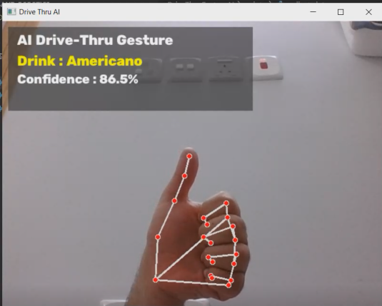

<div align="center">

# 🚗 DriveThru Gesture AI

### Real-Time Hand Gesture Recognition for Contactless Drive-Thru Ordering


</div>

---


## 📖 Overview

**DriveThru Gesture AI** is a real-time computer vision application that demonstrates how artificial intelligence can simplify contactless ordering in drive-thru environments.

The application detects a user's hand through a webcam, extracts **21 hand landmarks** using **MediaPipe**, and classifies predefined gestures using a **Random Forest** machine learning model. Each gesture is mapped to a specific drink, allowing users to interact with the system naturally without touching any physical interface.

Unlike projects that rely on publicly available datasets, this project includes the complete machine learning workflow. The dataset was collected manually, processed, used to train the classification model, and finally integrated into a real-time prediction system.

The application displays the predicted drink together with the confidence score, providing a practical demonstration of Computer Vision and Machine Learning working together in a real-world inspired scenario.

---

━━━━━━━━━━━━━━━━━━━━━━━━━━━━━━━━━━━━━━━━━━━━━━━━━━━━━━━━━━━━━━━━━━━━━━━━━━━━━━━━━━━━━━━━━━━━━━━━━━━━━━━━━━━━━━━━━━━━━━━━━━━━━━━━━━━━━━━━━━━━━━━━━━━━━━━━━━━━━━━━━━━

## 📖 نبذة عن المشروع

**DriveThru Gesture AI** هو مشروع يعتمد على تقنيات الرؤية الحاسوبية والذكاء الاصطناعي لتقديم نموذج أولي لنظام طلبات درايف ثرو يعمل بدون الحاجة إلى لمس أي شاشة أو جهاز.

يقوم النظام بالتعرف على يد المستخدم باستخدام كاميرا الويب، ثم استخراج **21 نقطة مرجعية لليد** بواسطة **MediaPipe**، وبعد ذلك يتم تصنيف الإيماءات باستخدام نموذج تعلم آلي من نوع **Random Forest**. تمثل كل إيماءة طلبًا لمشروب مختلف، مما يسمح للمستخدم بالتفاعل مع النظام بطريقة طبيعية وسريعة.

لا يعتمد المشروع على مجموعة بيانات جاهزة، بل تم إنشاء مجموعة بيانات خاصة بالمشروع، ثم استخدامها في تدريب النموذج واختباره قبل دمجه في نظام يعمل في الزمن الحقيقي.

يعرض التطبيق اسم المشروب المتوقع بالإضافة إلى نسبة الثقة أثناء التشغيل، موضحًا كيف يمكن دمج الرؤية الحاسوبية مع التعلم الآلي في تطبيق عملي مستوحى من بيئة طلبات الدرايف ثرو.
---

# 🎥 Demo | العرض التوضيحي


A demonstration video of the system is included in the project repository.

**Location:**

```text
https://github.com/user-attachments/assets/84bb7e19-eb15-4049-9928-9d15e926d3a2

```

The video demonstrates the real-time hand gesture recognition process and how each gesture is translated into a drink selection.

---

━━━━━━━━━━━━━━━━━━━━━━━━━━━━━━━━━━━━━━━━━━━━━━━━━━━━━━━━━━━━━━━━━━━━━━━━━━━━━━━━━━━━━━━━━━━━━━━━━━━━━━━━━━━━━━━━━━━━━━━━━━━━━━━━━━━━━━━━━━━━━━━━━━━━━━━━━━━━━━━━━━━

تم إرفاق فيديو توضيحي للمشروع داخل ملفات المشروع.

**المسار:**

```text
https://github.com/user-attachments/assets/84bb7e19-eb15-4049-9928-9d15e926d3a2

```

يوضح الفيديو آلية عمل النظام والتعرف على إيماءات اليد في الزمن الحقيقي وتحويلها إلى طلبات مشروبات مختلفة.

---

# 📸 Application Preview | واجهة التطبيق

<p align="center">
    
</p>

<p align="center">


Live prediction interface displaying the recognized drink and the model confidence score in real time.

━━━━━━━━━━━━━━━━━━━━━━━━━━━━━━━━━━━━━━━━━━━━━━━━━━━━━━━━━━━━━━━━━━━━━━━━━━━━━━━━━━━━━━━━━━━━━━━━━━━━━━━━━━━━━━━━━━━━━━━━━━━━━━━━━━━━━━━━━━━━━━━━━━━━━━━━━━━━━━━━━━━

واجهة التطبيق أثناء التشغيل، حيث يتم عرض اسم المشروب المتوقع ونسبة الثقة مباشرة بعد التعرف على الإيماءة.

</p>
---

# ✨ Features | المميزات


- 🎥 **Real-Time Hand Gesture Recognition** using a webcam.
- ✋ **MediaPipe Hand Tracking** with 21 hand landmarks.
- 🧠 **Random Forest Machine Learning Model** trained on a custom dataset.
- ☕ **Gesture-to-Drink Mapping** for contactless drive-thru ordering.
- 📊 **Confidence Score Display** for every prediction.
- ⚡ **Lightweight and Fast** real-time inference.
- 📁 **Custom Dataset** collected specifically for this project.
- 💾 **Reusable Trained Model** stored as a Joblib (`.pkl`) file.

---

━━━━━━━━━━━━━━━━━━━━━━━━━━━━━━━━━━━━━━━━━━━━━━━━━━━━━━━━━━━━━━━━━━━━━━━━━━━━━━━━━━━━━━━━━━━━━━━━━━━━━━━━━━━━━━━━━━━━━━━━━━━━━━━━━━━━━━━━━━━━━━━━━━━━━━━━━━━━━━━━━━━

- 🎥 التعرف على إيماءات اليد في الزمن الحقيقي باستخدام كاميرا الويب.
- ✋ تتبع اليد واستخراج **21 نقطة مرجعية** باستخدام **MediaPipe**.
- 🧠 استخدام نموذج **Random Forest** تم تدريبه على مجموعة بيانات خاصة بالمشروع.
- ☕ تحويل كل إيماءة إلى طلب مشروب لمحاكاة نظام طلبات الدرايف ثرو.
- 📊 عرض نسبة الثقة لكل عملية تصنيف بشكل مباشر.
- ⚡ أداء سريع وخفيف مناسب للتطبيقات الفورية.
- 📁 الاعتماد على مجموعة بيانات تم جمعها خصيصًا لهذا المشروع.
- 💾 حفظ النموذج المدرب بصيغة **Joblib (.pkl)** لإعادة استخدامه دون الحاجة إلى إعادة التدريب.
- ---

# ✋ Supported Gestures | الإيماءات المدعومة


| Hand Gesture | Drink | Description |
|--------------|-------|-------------|
| 👍 Thumbs Up | Americano | Selects an Americano drink. |
| ✌️ Peace | Latte | Selects a Latte drink. |
| 👌 OK | Mocha | Selects a Mocha drink. |
| 🖐 Open Palm | Cappuccino | Selects a Cappuccino drink. |

---

━━━━━━━━━━━━━━━━━━━━━━━━━━━━━━━━━━━━━━━━━━━━━━━━━━━━━━━━━━━━━━━━━━━━━━━━━━━━━━━━━━━━━━━━━━━━━━━━━━━━━━━━━━━━━━━━━━━━━━━━━━━━━━━━━━━━━━━━━━━━━━━━━━━━━━━━━━━━━━━━━━━

| الإيماءة | المشروب | الوصف |
|----------|---------|--------|
| 👍 إبهام للأعلى | أمريكانو | اختيار مشروب أمريكانو. |
| ✌️ علامة السلام | لاتيه | اختيار مشروب لاتيه. |
| 👌 علامة OK | موكا | اختيار مشروب موكا. |
| 🖐 راحة اليد المفتوحة | كابتشينو | اختيار مشروب كابتشينو. |
---

# 🧠 How It Works | آلية عمل النظام


The system follows a simple real-time machine learning pipeline:

```text
Webcam
   │
   ▼
Capture Video Frame
   │
   ▼
MediaPipe Hand Detection
   │
   ▼
Extract 21 Hand Landmarks
   │
   ▼
Feature Vector Generation
   │
   ▼
Random Forest Classifier
   │
   ▼
Predicted Drink + Confidence Score
   │
   ▼
Display the Result on Screen
```

### Workflow

1. The webcam continuously captures live video frames.
2. MediaPipe detects the user's hand and extracts **21 hand landmarks**.
3. Landmark coordinates are converted into a numerical feature vector.
4. The trained Random Forest model predicts the corresponding gesture.
5. The predicted gesture is mapped to a predefined drink.
6. The drink name and confidence score are displayed in real time.

---

━━━━━━━━━━━━━━━━━━━━━━━━━━━━━━━━━━━━━━━━━━━━━━━━━━━━━━━━━━━━━━━━━━━━━━━━━━━━━━━━━━━━━━━━━━━━━━━━━━━━━━━━━━━━━━━━━━━━━━━━━━━━━━━━━━━━━━━━━━━━━━━━━━━━━━━━━━━━━━━━━━━

يعتمد النظام على سلسلة من الخطوات لمعالجة الصورة والتنبؤ بالإيماءة في الزمن الحقيقي:

```text
كاميرا الويب
    │
    ▼
التقاط إطار من الفيديو
    │
    ▼
اكتشاف اليد باستخدام MediaPipe
    │
    ▼
استخراج 21 نقطة مرجعية لليد
    │
    ▼
تحويل البيانات إلى متجه خصائص
    │
    ▼
تصنيف الإيماءة بواسطة Random Forest
    │
    ▼
تحديد المشروب المناسب مع نسبة الثقة
    │
    ▼
عرض النتيجة على الشاشة
```

### آلية العمل

1. تلتقط الكاميرا الفيديو بشكل مستمر.
2. يقوم MediaPipe باكتشاف اليد واستخراج **21 نقطة مرجعية**.
3. يتم تحويل الإحداثيات إلى متجه خصائص يمكن للنموذج فهمه.
4. يستخدم نموذج **Random Forest** هذه البيانات لتحديد الإيماءة.
5. يتم ربط الإيماءة بالمشروب المقابل لها.
6. يعرض النظام اسم المشروب ونسبة الثقة مباشرة أثناء التشغيل.
   ---

# 📂 Project Structure | هيكل المشروع


```text
AI-and-Robotics
│
└── DriveThruGestureAI
    │
    ├── assets
    │   ├── demo.mp4
    │   └── screenshot.bmp
    │
    ├── data
    │   └── gesture_dataset.csv
    │
    ├── models
    │   └── gesture_model.pkl
    │
    ├── scripts
    │   ├── collect_data.py
    │   ├── train.py
    │   └── predict.py
    │
    ├── requirements.txt
    └── README.md
```

### Directory Description

| Folder / File | Description |
|---------------|-------------|
| **assets/** | Contains screenshots and demonstration media. |
| **data/** | Stores the dataset used for training the model. |
| **models/** | Stores the trained Machine Learning model. |
| **scripts/** | Contains all project source code. |
| **requirements.txt** | Lists the required Python packages. |
| **README.md** | Project documentation and usage guide. |

---

━━━━━━━━━━━━━━━━━━━━━━━━━━━━━━━━━━━━━━━━━━━━━━━━━━━━━━━━━━━━━━━━━━━━━━━━━━━━━━━━━━━━━━━━━━━━━━━━━━━━━━━━━━━━━━━━━━━━━━━━━━━━━━━━━━━━━━━━━━━━━━━━━━━━━━━━━━━━━━━━━━━
```text
AI-and-Robotics
│
└── DriveThruGestureAI
    │
    ├── assets
    │   ├── demo.mp4
    │   └── screenshot.bmp
    │
    ├── data
    │   └── gesture_dataset.csv
    │
    ├── models
    │   └── gesture_model.pkl
    │
    ├── scripts
    │   ├── collect_data.py
    │   ├── train.py
    │   └── predict.py
    │
    ├── requirements.txt
    └── README.md
```

### وصف المجلدات

| المجلد / الملف | الوصف |
|----------------|-------|
| **assets/** | يحتوي على الصور والفيديو التوضيحي للمشروع. |
| **data/** | يحتوي على مجموعة البيانات المستخدمة في التدريب. |
| **models/** | يحتوي على النموذج المدرب بصيغة Joblib. |
| **scripts/** | يحتوي على جميع ملفات المشروع البرمجية. |
| **requirements.txt** | يحتوي على جميع المكتبات المطلوبة لتشغيل المشروع. |
| **README.md** | ملف توثيق المشروع وشرح طريقة التشغيل. |
---

# ⚙️ Installation | التثبيت


### 1. Clone the repository

```bash
git clone https://github.com/DevRah0/ai-and-Robotics.git
```

### 2. Navigate to the project directory

```bash
cd ai-and-Robotics/DriveThruGestureAI
```

### 3. Create a Conda environment (Recommended)

```bash
conda create -n gesture-ai python=3.11
```

### 4. Activate the environment

```bash
conda activate gesture-ai
```

### 5. Install the required dependencies

```bash
pip install -r requirements.txt
```

### 6. Verify the installation (Optional)

```bash
python scripts/predict.py
```

If the camera opens successfully, the installation has been completed correctly.

---

 ━━━━━━━━━━━━━━━━━━━━━━━━━━━━━━━━━━━━━━━━━━━━━━━━━━━━━━━━━━━━━━━━━━━━━━━━━━━━━━━━━━━━━━━━━━━━━━━━━━━━━━━━━━━━━━━━━━━━━━━━━━━━━━━━━━━━━━━━━━━━━━━━━━━━━━━━━━━━━━━━━━━ 

### 1. استنساخ المستودع

```bash
git clone https://github.com/DevRah0/ai-and-Robotics.git
```

### 2. الانتقال إلى مجلد المشروع

```bash
cd ai-and-Robotics/DriveThruGestureAI
```

### 3. إنشاء بيئة Conda (موصى بها)

```bash
conda create -n gesture-ai python=3.11
```

### 4. تفعيل البيئة

```bash
conda activate gesture-ai
```

### 5. تثبيت جميع المكتبات المطلوبة

```bash
pip install -r requirements.txt
```

### 6. التحقق من نجاح التثبيت (اختياري)

```bash
python scripts/predict.py
```

إذا تم فتح الكاميرا بدون ظهور أخطاء، فهذا يعني أن التثبيت تم بنجاح.
---

# ▶️ Usage | التشغيل


Run the application:

```bash
python scripts/predict.py
```

Show one of the supported hand gestures in front of the webcam. The system will display the predicted drink and the confidence score in real time.

---

━━━━━━━━━━━━━━━━━━━━━━━━━━━━━━━━━━━━━━━━━━━━━━━━━━━━━━━━━━━━━━━━━━━━━━━━━━━━━━━━━━━━━━━━━━━━━━━━━━━━━━━━━━━━━━━━━━━━━━━━━━━━━━━━━━━━━━━━━━━━━━━━━━━━━━━━━━━━━━━━━━━

لتشغيل المشروع:

```bash
python scripts/predict.py
```

وجّه إحدى الإيماءات المدعومة نحو الكاميرا، وسيعرض النظام اسم المشروب المتوقع مع نسبة الثقة مباشرة.
---

# 🏋️ Model Training | تدريب النموذج


After collecting a new dataset, retrain the model using:

```bash
python scripts/train.py
```

The trained model will be saved automatically inside the **models** directory.

---

━━━━━━━━━━━━━━━━━━━━━━━━━━━━━━━━━━━━━━━━━━━━━━━━━━━━━━━━━━━━━━━━━━━━━━━━━━━━━━━━━━━━━━━━━━━━━━━━━━━━━━━━━━━━━━━━━━━━━━━━━━━━━━━━━━━━━━━━━━━━━━━━━━━━━━━━━━━━━━━━━━━

بعد جمع بيانات جديدة، يمكن إعادة تدريب النموذج باستخدام:

```bash
python scripts/train.py
```

وسيتم حفظ النموذج الجديد تلقائيًا داخل مجلد **models**.
---

# 📊 Results | النتائج

| Metric | Value |
|--------|------:|
| Model | Random Forest |
| Accuracy | **96%** |
| Hand Landmarks | 21 |
| Supported Gestures | 4 |
---

# 🚀 Future Improvements | التطوير المستقبلي

- Add more hand gestures.
- Improve prediction accuracy.
- Support dynamic gestures.
- Add a graphical user interface (GUI).

━━━━━━━━━━━━━━━━━━━━━━━━━━━━━━━━━━━━━━━━━━━━━━━━━━━━━━━━━━━━━━━━━━━━━━━━━━━━━━━━━━━━━━━━━━━━━━━━━━━━━━━━━━━━━━━━━━━━━━━━━━━━━━━━━━━━━━━━━━━━━━━━━━━━━━━━━━━━━━━━━━━

- إضافة إيماءات جديدة.
- تحسين دقة النموذج.
- دعم الإيماءات الحركية.
- تطوير واجهة رسومية.

  ---

# 👨‍💻 Author

**Abdulrahman**


