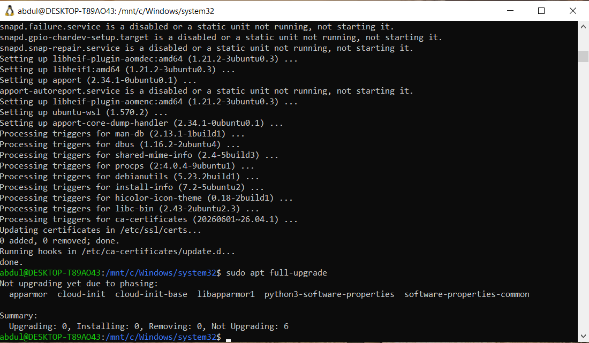
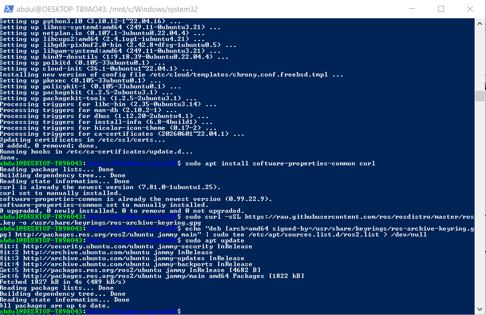
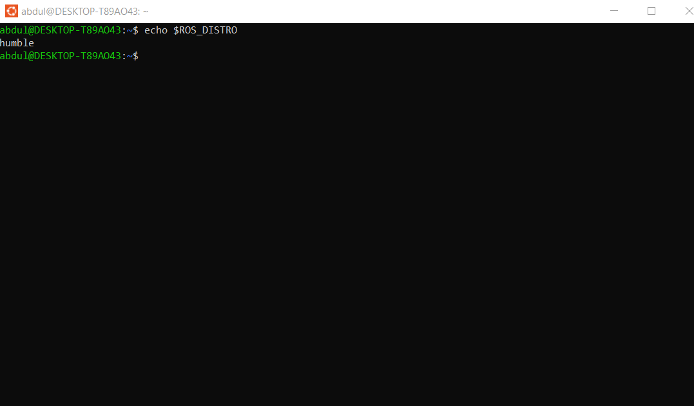
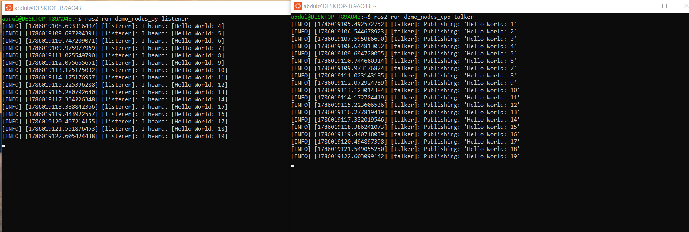

# ROS 2 Humble on Ubuntu 22.04 (WSL2)


---

# 📖 Overview

This repository documents the installation and verification of **ROS 2 Humble Hawksbill** on **Ubuntu 22.04 LTS** running through **Windows Subsystem for Linux 2 (WSL2)**.

The installation was successfully verified by running the official ROS 2 demo nodes (`talker` and `listener`) and confirming communication between Publisher and Subscriber nodes.

---

# 🎯 Objectives

- Install Ubuntu 22.04 LTS using WSL2.
- Install ROS 2 Humble Hawksbill.
- Configure the ROS environment.
- Verify the installation using the official demo nodes.
- Test Publisher / Subscriber communication.

---

# 🖥️ Environment

| Component | Version |
|-----------|----------|
| Operating System | Windows 10 |
| Linux Distribution | Ubuntu 22.04 LTS |
| Platform | WSL2 |
| ROS Version | ROS 2 Humble Hawksbill |

---

# 🛠️ Technologies

- Ubuntu 22.04 LTS
- Windows Subsystem for Linux 2 (WSL2)
- ROS 2 Humble
- Python
- C++
- Ubuntu Terminal

---

# 📂 Project Structure

```text
ROS2-Humble/
│
├── README.md
│
└── screenshots/
    ├── 1.bmp
    ├── 2.bmp
    ├── 3.bmp
    └── 4.bmp
```

---

# 🚀 Installation Process

## 1. Update Ubuntu

Update all packages before installing ROS 2.

```bash
sudo apt update
sudo apt upgrade -y
```

<p align="center">
  
</p>

---

## 2. Install ROS 2 Humble

Configure the ROS 2 repository and install ROS 2 Humble.

```bash
sudo apt install ros-humble-desktop
```

<p align="center">
  
</p>

---

## 3. Configure the Environment

Load the ROS environment.

```bash
source /opt/ros/humble/setup.bash
```

Verify the installed ROS version.

```bash
echo $ROS_DISTRO
```

Expected output:

```text
humble
```

<p align="center">
  
</p>

---

## 4. Verify ROS 2

Run the Publisher node.

```bash
ros2 run demo_nodes_cpp talker
```

Open another terminal and run the Subscriber node.

```bash
ros2 run demo_nodes_py listener
```

If the installation is successful, the listener will receive messages similar to:

```text
I heard: [Hello World: 1]
I heard: [Hello World: 2]
...
```

<p align="center">
  
</p>

---

# ✅ Result

The installation and configuration of **ROS 2 Humble Hawksbill** on **Ubuntu 22.04 LTS (WSL2)** were completed successfully.

The communication between the **Talker** and **Listener** demo nodes confirmed that the ROS 2 environment is working correctly.

---

# 📚 Learning Outcomes

- Install Ubuntu using WSL2.
- Install ROS 2 Humble.
- Configure the ROS environment.
- Execute ROS 2 commands.
- Understand Publisher / Subscriber communication.
- Verify successful ROS 2 installation.

---

# 📄 License

This repository is intended for educational purposes only.

---

<div align="center">

### Developed by Abdulrahman Al-Rubaie

Computer Engineering Student • ROS 2 Learner • Robotics Enthusiast

</div>
