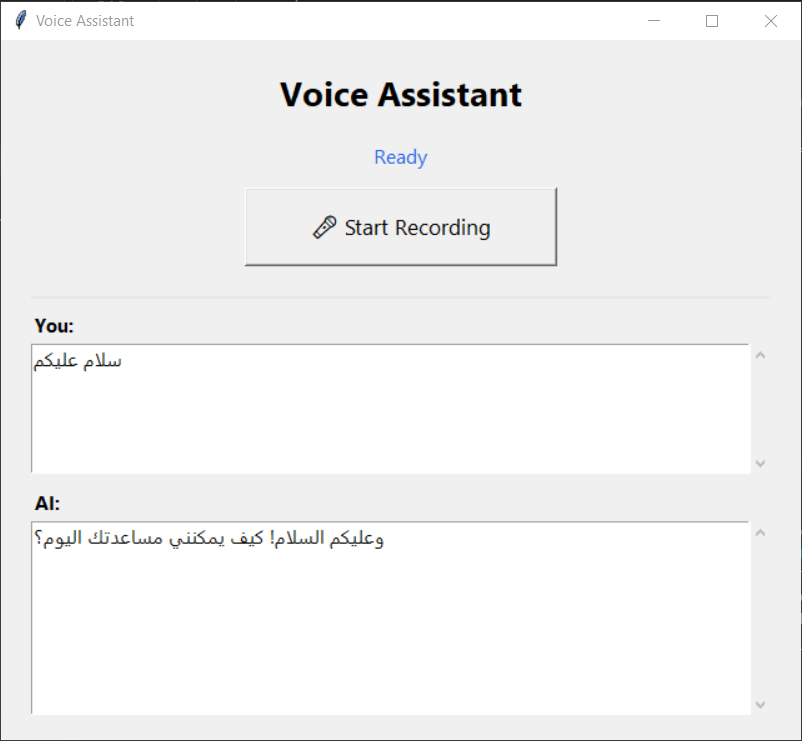

# 🎤 Voice Assistant

A desktop **Voice Assistant** built with Python and Tkinter.
Speak → Whisper (speech-to-text) → Gemini API (AI response) → gTTS (text-to-speech) → playback.

مساعد صوتي سطح مكتب مكتوب بلغة Python وواجهة Tkinter.
تتحدث → Whisper (تحويل الكلام لنص) → Gemini API (استجابة الذكاء الاصطناعي) → gTTS (تحويل النص لصوت) → تشغيل الصوت.

---

## 🙋‍♂️ Overview | نظرة عامة

A window with a **Start Recording** button. Press it, speak, press again, and the app:
1. Records your microphone.
2. Converts speech to text with **Whisper**.
3. Sends the text to the **Gemini API** and gets an answer.
4. Speaks the answer aloud (gTTS + pygame).
5. Shows both your speech and the AI response in the window.

نافذة بزر **بدء التسجيل**. اضغط، تكلّم، اضغط مجددًا، فيقوم التطبيق بـ:
1. تسجيل الميكروفون.
2. تحويل الكلام إلى نص عبر **Whisper**.
3. إرسال النص إلى **Gemini API** والحصول على الإجابة.
4. نطق الإجابة صوتيًا (gTTS + pygame).
5. عرض كلامك واستجابة الذكاء الاصطناعي داخل النافذة.

---

## ✨ Features | الميزات

- 🎤 One-click recording with Tkinter.
- 🧠 Whisper speech-to-text (offline model).
- 🤖 Gemini API responses.
- 🔊 Automatic speech playback (gTTS + pygame).
- 🔒 API key loaded from `.env` (never hard-coded).
- 🛡️ Friendly error messages — never crashes unexpectedly.

- 🎤 تسجيل بضغطة زر بواجهة Tkinter.
- 🧠 تحويل الكلام لنص عبر Whisper (نموذج محلي).
- 🤖 استجابات من Gemini API.
- 🔊 تشغيل صوتي تلقائي (gTTS + pygame).
- 🔒 مفتاح API يُحمَّل من `.env` (لا يُكتب في الكود أبدًا).
- 🛡️ رسائل أخطاء واضحة — لا يتعطل فجأة.

---

## 📸 Screenshots | لقطات الشاشة




---

## 🧰 Technologies | التقنيات

| Purpose | Library |
|---|---|
| GUI | `tkinter` |
| Speech-to-text | `openai-whisper` |
| AI response | `google-genai` |
| Text-to-speech | `gTTS` |
| Playback | `pygame` |
| Audio capture | `sounddevice` |
| WAV write | `scipy` + `numpy` |
| Environment | `python-dotenv` |

---

## ⚙️ Installation | التثبيت

### 1) Requirements | المتطلبات

- **Python 3.11+**
- A working microphone + speakers.
- (Windows) `Microsoft Visual C++ Redistributable` if needed for sounddevice.

### 2) Create a virtual environment | أنشئ بيئة افتراضية

**Windows (PowerShell):**
```powershell
cd VoiceAssistant
python -m venv venv
venv\Scripts\Activate.ps1
```

**Linux / macOS:**
```bash
cd VoiceAssistant
python -m venv venv
source venv/bin/activate
```

### 3) Install dependencies | ثبّت المتطلبات

```bash
pip install -r requirements.txt
# torch (for Whisper) is large and platform-specific; install separately:
pip install torch
```

### 4) Configure the API key | اضبط مفتاح API

**Windows (PowerShell):**
```powershell
Copy-Item .env.example .env
# Then open .env and set: GEMINI_API_KEY=your API key here
```

**Linux/macOS:**
```bash
cp .env.example .env
# Then open .env and set: GEMINI_API_KEY=your API key here
```

> 🔒 The real `.env` is git-ignored and never committed.

---

## 🚀 Usage | الاستخدام

```bash
python main.py
```

1. Click **🎤 Start Recording**.
2. Speak into the microphone.
3. Click **🛑 Stop Recording**.
4. Watch the status: *Processing → Generating response → Playing response → Ready*.
5. Your words and the AI reply appear in the window.

---

## 📁 Project Structure | هيكل المشروع

```
VoiceAssistant/
├── main.py
├── requirements.txt
├── README.md
├── .env.example
├── .gitignore
├── audio/
│   ├── temp.wav
│   └── output.mp3
└── screenshots/
```

---

## 🔄 Workflow | آلية العمل

```
Start Recording ─► microphone ─► temp.wav ─► Whisper (STT)
      ─► Gemini API ─► response.text ─► gTTS ─► output.mp3
      ─► pygame playback ─► update GUI ─► Ready
```

Status transitions: **Ready → Recording… → Processing… → Generating response… → Playing response… → Ready**

حالات الحالة: **جاهز → تسجيل… → معالجة… → توليد الاستجابة… → تشغيل الاستجابة… → جاهز**

---

## 🛠️ Troubleshooting | استكشاف الأخطاء

| Problem | Fix |
|---|---|
| `Microphone unavailable` | Connect a mic; check OS privacy/input settings. |
| `Whisper failed` | Install `torch` and model downloads; retry. |
| `Gemini error` | Check internet + that `GEMINI_API_KEY` is set in `.env`. |
| `API key is missing` | Create `.env` from `.env.example` (Windows: `Copy-Item`, Linux/mac: `cp`) and fill the key. |
| No audio plays | Install `pygame`; check volume/speakers. |

---

## 📜 License | الرخصة

MIT

---

## 👨‍💻 Author | المطوّر

**Abdulrahman Al-Rubaie** — [@DevRah0](https://github.com/DevRah0)
